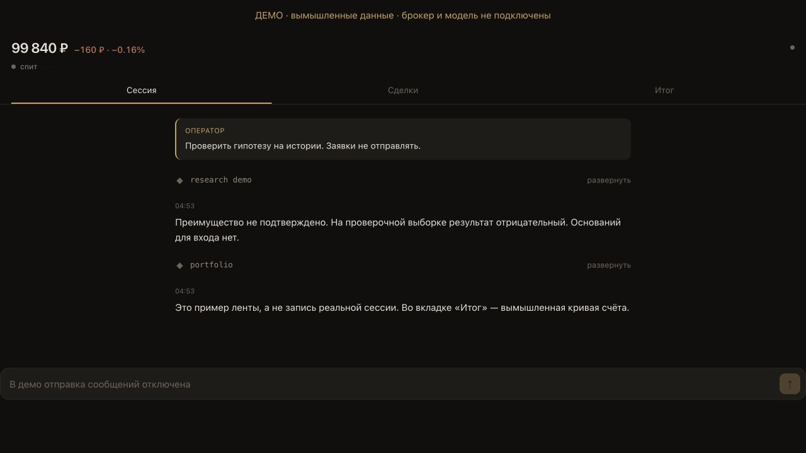
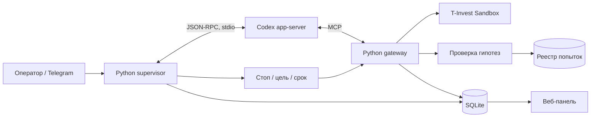

# tinvest-agent

[](https://github.com/Ev0lv3nta/tinvest-agent/actions/workflows/ci.yml)

Что будет, если дать ИИ счёт на 100 000 виртуальных рублей и предложить
торговать самостоятельно?

Агент читает новости и котировки, придумывает торговые идеи, проверяет их на
истории и может отправлять заявки в песочницу T-Invest. За его действиями
можно следить в веб-панели и обсуждать их с ним через Telegram.

Это личный эксперимент. Хочется посмотреть, какие решения он будет принимать
и что из этого выйдет. Реальные деньги не используются, прибыльность пока
не подтверждена.

Модель не управляет всем подряд: размер позиции ограничивает код, стопы
тоже исполняются без её участия. Ниже — как это устроено и как запустить демо.

## Попробовать без ключей

Нужен Python 3.11+ на Linux или macOS. Python-зависимостей сверх стандартной
библиотеки нет. Windows для полного проекта не поддерживается: блокировка
заявок использует `fcntl`, серверная установка — systemd.

```bash
git clone https://github.com/Ev0lv3nta/tinvest-agent.git
cd tinvest-agent
python3 -m unittest discover -t . -s tests -q
python3 -m research demo
```

Первая команда проверки запускает тесты с подставным брокером и временной базой.
Вторая прогоняет несколько правил на синтетическом случайном блуждании.
Для стандартного seed ожидается `"verdict": "преимущество не подтверждено"`.
Это отрицательный контроль оценщика, а не торговый результат.

Панель можно посмотреть отдельно:

```bash
python3 examples/panel_demo.py
```

Откройте ссылку из терминала. Демо слушает только `127.0.0.1`, создаёт временную
базу с вымышленными данными и не подключает брокера, модель или Telegram.
Отправка сообщений отключена. `Ctrl+C` останавливает сервер и удаляет базу.
Если порт занят: `python3 examples/panel_demo.py --port 8081`.



## Как устроено



- **`gateway/`** — клиент REST API, MCP-инструменты, проверки риска и журнал
  заявок. Намерение отправить заявку сохраняется до сетевого запроса.
- **`supervisor/`** — сессия модели, очередь событий, наблюдатели и восстановление.
  Отдельный поток исполняет стоп, цель и срок позиции без решения модели.
- **`research/`** — бэктест и проверка на отложенных данных. Выбор правила идёт на
  обучающей части; оценка учитывает издержки, задержку входа и число попыток.
- **`webapp/`** — лента сессии, заявки и состояние счёта. В полном стенде оператор
  также может отправить сообщение агенту.
- **`deploy/`** — установка Linux-стенда, systemd, резервные копии и обновление
  с проверкой новой версии перед заменой старой.

## Какие случаи разобраны

| Ситуация | Поведение |
| --- | --- |
| Связь оборвалась при отправке заявки | Состояние становится «неизвестно». Повторный вход блокируется до выяснения результата у брокера. |
| Цена достигла стопа, пока модель занята | Условие фиксирует отдельный поток. Решение о выходе сохраняется в базе и переживает перезапуск. |
| Агент предлагает слишком большой объём | Код проверяет деньги, размер риска, число позиций и дневные ограничения до отправки. |
| Агент сам написал убедительную статистику | Реестр отличает ручную оценку от результата общего исследовательского прогона. |
| Лучшее из множества правил случайно оказалось прибыльным | Оценщик учитывает число попыток и проверяет результат вне обучения. |
| Обновление не запустилось | Скрипт развёртывания возвращает предыдущую версию. Намеренно остановленный агент остаётся остановленным. |

Подробности и причины решений — в [архитектуре](docs/architecture.md).
Инструкции самой модели лежат в [AGENTS.md](AGENTS.md); это роль участника
эксперимента, а не инструкция по установке проекта.

## Проверки и границы

CI запускает тесты и синтетическое демо на Python 3.11–3.13 в Linux и macOS.
Тесты покрывают ограничения риска, неизвестный результат заявки, частичное
исполнение, восстановление, очередь событий, авторизацию панели и ошибки
оценки на истории.

Полный стенд требует T-Invest Sandbox, совместимого Codex app-server и шлюза
модели. Настройка описана в [docs/setup.md](docs/setup.md). Эти внешние сервисы
не участвуют в CI. Прохождение тестов не заменяет сквозную проверку стенда.

Ограничения текущей реализации:

- Агент и журнал работают от одного пользователя ОС. Сверка и резервные копии
  помогают обнаружить изменения, но не создают строгую изоляцию.
- Стоп проверяется периодически и зависит от доступности брокера. Точная цена
  выхода не гарантируется.
- Календарь торгов упрощён; полноценного учёта праздников и особых сессий нет.
- Бэктест работает по барам и не воспроизводит очередь заявок и микроструктуру.
  Положительный результат сам по себе не подтверждает работоспособную стратегию.
- Интеграция модели рассчитана на конкретный протокол app-server и шлюз
  OmniRoute. Совместимость с произвольным провайдером не заявляется.

Ближайшие задачи — сквозной прогон актуальной версии в песочнице, календарь
торгов и разделение прав процессов. Добавлять торговые стратегии до проверки
этого поведения было бы преждевременно.

## Разработка

Основная проверка: `python3 -m unittest discover -t . -s tests -q`.
При исправлении ошибки полезнее тест на конкретный сбой, чем тест на форму
реализации. Изменения протокола и схемы журнала должны учитывать перезапуск
с уже существующей базой.

Код распространяется по [MIT License](LICENSE). Корневой сертификат в
`deploy/RussianTrustedRootCA.pem` — сторонний файл доверия для API, не авторский
код проекта.
